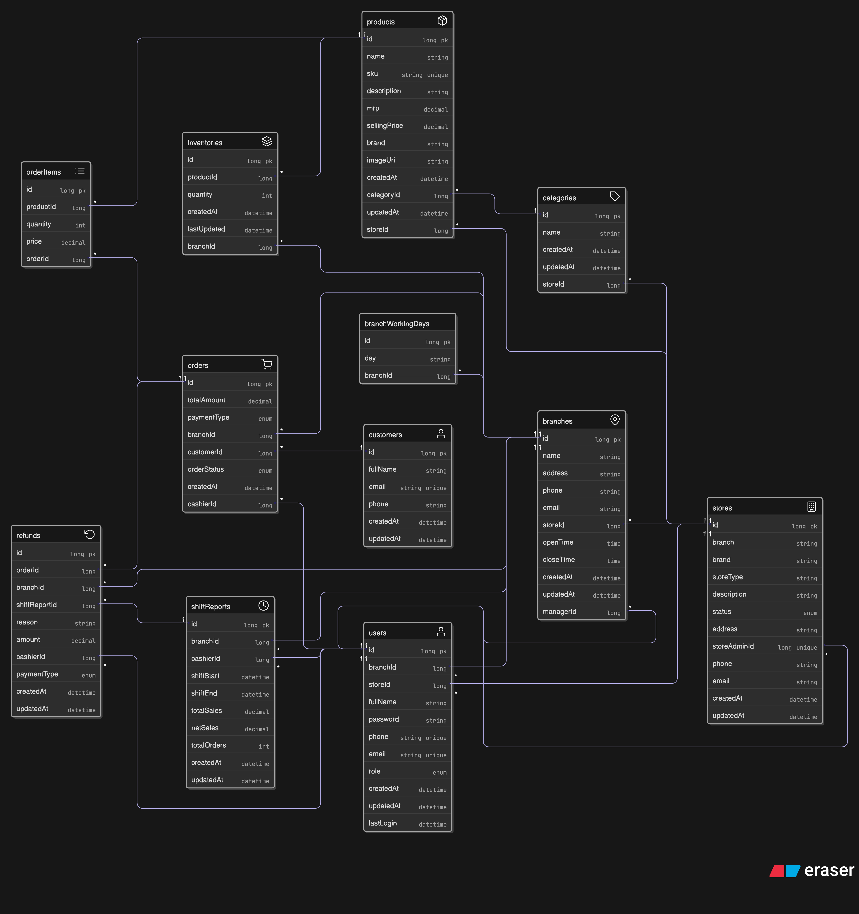
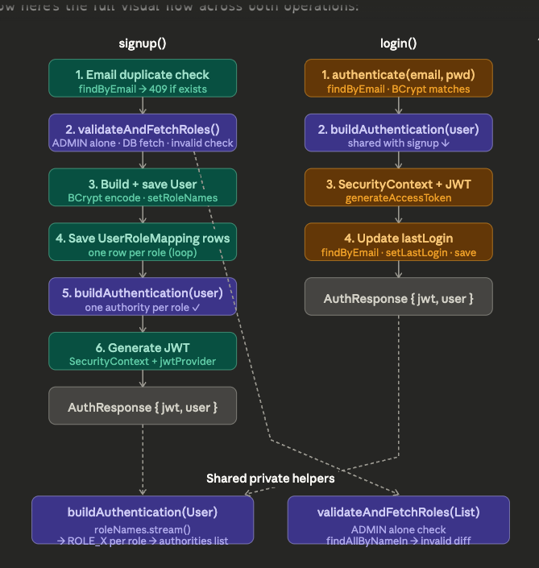

# SaaS POS System - API Documentation


### Docker
```shell
docker-compose up -d
docker exec -it saas-pos-mysql-db mysql -u root -p
root
show databases;
use saas-pos
show tables;
```
## Database 
```
+------------------------------------+
| Tables_in_saas-pos                 |
+------------------------------------+
| branch_working_days                |
| branches                           |
| categories                         |
| customers                          |
| inventories                        |
| order_items                        |
| orders                             |
| products                           |
| refunds                            |
| shift_reports                      |
| shift_reports_recent_orders        |
| shift_reports_top_selling_products |
| stores                             |
| users                              |
| Role                               |
| UserRoleMapping                    |
+------------------------------------+
```

### Schema design

```shell
https://app.eraser.io/workspace/9n9DiRjGqNB2LPjV5IOh?diagram=zr4EsE6GvrSx5F-okKjdI
```





---
### Seeder Roles  in Role Table
```
public enum RoleName {
ADMIN,
STORE_MANAGER,
BRANCH_MANAGER,
BRANCH_CASHIER
}
```
Base URL: `api/v1/roles`
GET requests

---

Base URL: `api/v2`

---

## Table of Contents

- [Auth APIs](#auth-apis)
- [User APIs](#user-apis)
- [Store APIs](#store-apis)
- [Branch APIs](#branch-apis)
- [Product APIs](#product-apis)
- [Category APIs](#category-apis)
- [Inventory APIs](#inventory-apis)
- [Customer APIs](#customer-apis)
- [Employee APIs](#employee-apis)
- [Order APIs](#order-apis)
- [Refund APIs](#refund-apis)
- [Shift Report APIs](#shift-report-apis)
- [Enums](#enums)
- [Models](#models)

---

## Auth APIs
POSTMAN URI [Req to access]
```shell
https://crimson-comet-847628.postman.co/workspace/springBoot-fitness~3624bf6f-c3b5-4845-b04e-6d7f7fcd62fc/collection/25455646-5af24c3a-29fb-4d4a-b20e-681bdb72e7a0?action=share&source=copy-link&creator=25455646
```

Base Path: `api/v2/auth`

---

#### Full picture
```
Request
   │
   ▼
① Email duplicate check  ──→ 409 if exists
   │
   ▼
② validateAndFetchRoles()
   ├─ ADMIN alone rule
   ├─ DB fetch roles
   └─ invalid role check  ──→ 400 if bad role
   │
   ▼
③ Build User entity
   └─ BCrypt hash password
   │
   ▼
④ Save User (users table)
   │
   ▼
⑤ Save UserRoleMapping rows (one per role)
   │
   ▼
⑥ Build Spring Authentication object
   │
   ▼
⑦ Set SecurityContext
   │
   ▼
⑧ Generate JWT
   │
   ▼
⑨ Return AuthResponse { jwt, message, user }
```
### POST `/signup` - Register a new user

**Request Body** (`UserDto`):
```json
{
  "fullName": "string (required, max 100)",
  "password": "string (required, min 8, max 100)",
  "phone": "string (required, 10-15 digits)",
  "email": "string (required, valid emaiAdmin registration is not allowed.l)",
  "role": "ROLE_ADMIN | ROLE_STORE_MANAGER | ROLE_BRANCH_MANAGER | ROLE_CASHIER | ROLE_CLIENT (required)",
  "storeId": "number (optional)",
  "branchId": "number (optional)"
},
{
  "fullName": "Arya",
  "password": "StrongPass123",
  "phone": "9983340545",
  "email": "arya1889@gmail.com",
  "storeId": 1, //should be present already 
  "branchId": 2, // should be present already 
  "role": "ROLE_CLIENT" // not Role_admin
}
```
- NOTE : ROLE_ADMIN :- Admin registration is not allowed.
**Response** (`AuthResponse`):
```json
{
  "jwt": "string",
  "message": "string",
  "user": {
    "id": 1,
    "fullName": "string",
    "phone": "string",
    "email": "string",
    "storeId": 1,
    "branchId": 1,
    "role": "ROLE_ADMIN",
    "createdAt": "2025-01-01T00:00:00",
    "updatedAt": "2025-01-01T00:00:00",
    "lastLogin": "2025-01-01T00:00:00"
  }
},

{
  "jwt": "eyJhbGc......rrBJFRdsOMlk6G4q4RZjUYmE7DZWA",
  "message": "User registered successfully",
  "user": {
    "id": 3,
    "fullName": "Arya",
    "password": null,
    "phone": "9983340545",
    "email": "arya1889@gmail.com",
    "storeId": null,
    "branchId": null,
    "role": "ROLE_CLIENT",
    "createdAt": "2026-03-11T21:43:57.242135",
    "updatedAt": null, // why are NULL
    "lastLogin": null
  }
}
```

[IMPORTANT]
Event	createdAt	updatedAt	lastLogin
Signup	now	null	null
First Login	same	null	now
Profile Update	same	now	lastLogin
---

### POST `/login` - Login user

**Request Body** (`UserDto`):
```json
{
  "email": "string (required)",
  "password": "string (required)"
},
{
  "email": "arya1889@gmail.com",
  "password": "StrongPass123"
}
```

**Response** (`AuthResponse`):
```json
{
  "jwt": "string",
  "message": "string",
  "user": {
    "id": 1,
    "fullName": "string",
    "email": "string",
    "phone": "string",
    "role": "ROLE_ADMIN",
    "storeId": 1,
    "branchId": 1,
    "createdAt": "2025-01-01T00:00:00",
    "updatedAt": "2025-01-01T00:00:00",
    "lastLogin": "2025-01-01T00:00:00"
  }
},
{
"jwt": "ey........4g8pfp-npl2WSe9aSU9hbLLOwE",
"message": "Login successful",
"user": {
"id": 3,
"fullName": "Arya",
"password": null,
"phone": "9983340545",
"email": "arya1889@gmail.com",
"storeId": null,
"branchId": null,
"role": "ROLE_CLIENT",
"createdAt": "2026-03-11T21:43:57.242135",
"updatedAt": "2026-03-11T22:02:27.089861",
"lastLogin": "2026-03-11T22:02:27.061277"
}
}
```

---

## User APIs

Base Path: `api/v2/user/`

### GET `/me` - Get current logged-in user

**Headers**: `Authorization: Bearer <jwt>`

**Response** (`UserDto`):
```json
{
  "id": 1,
  "fullName": "string",
  "phone": "string",
  "email": "string",
  "storeId": 1,
  "branchId": 1,
  "role": "ROLE_ADMIN",
  "createdAt": "2025-01-01T00:00:00",
  "updatedAt": "2025-01-01T00:00:00",
  "lastLogin": "2025-01-01T00:00:00"
},
{
"id": 3,
"fullName": "Arya",
"password": null,
"phone": "9983340545",
"email": "arya1889@gmail.com",
"storeId": null,
"branchId": null,
"role": "ROLE_CLIENT",
"createdAt": "2026-03-11T21:43:57.242135",
"updatedAt": "2026-03-11T22:02:27.089861",
"lastLogin": "2026-03-11T22:02:27.061277"
}
```

---

### GET `/token` - Get user from JWT token

**Headers**: `Authorization: Bearer <jwt>`

**Response** (`UserDto`): Same as above.

---

### GET `/{id}` - Get user by ID

**Access**: `ROLE_ADMIN` only

**Path Params**: `id` (Long) - User ID

**Response** (`UserDto`): Same as above.

---

### GET `/email/{email}` - Get user by email

**Access**: `ROLE_ADMIN` only

**Path Params**: `email` (String)

**Response** (`UserDto`): Same as above.

---

### GET `/` - Get all users

**Access**: `ROLE_ADMIN` only

**Response** (`List<UserDto>`):
```json
[
  {
    "id": 1,
    "fullName": "string",
    "phone": "string",
    "email": "string",
    "storeId": 1,
    "branchId": 1,
    "role": "ROLE_ADMIN",
    "createdAt": "2025-01-01T00:00:00",
    "updatedAt": "2025-01-01T00:00:00",
    "lastLogin": "2025-01-01T00:00:00"
  }
]
```

---

## Store APIs

Base Path: `api/v2/store`

### POST `/` - Create store

**Headers**: `Authorization: Bearer <jwt>`

**Request Body** (`StoreDto`):
```json
{
  "brand": "string (required)",
  "storeType": "string (required)",
  "description": "string (optional)",
  "contact": {
    "address": "string",
    "phone": "string",
    "email": "string"
  }
}


```

```shell
{
  "brand": "Arya Retail",
  "storeAdminId": 3,
  "storeType": "RETAIL",
  "description": "Electronics and mobile accessories store",
  "status": "ACTIVE",
  "contact": {
    "phone": "9983340125",
    "email": "support@aryaretail.com",
    "address": "Jaipur, Rajasthan, India"
  }
}
```

**Response** (`StoreDto`):
```json
{
  "id": 1,
  "branch": "string",
  "brand": "string",
  "storeType": "string",
  "description": "string",
  "status": "ACTIVE",
  "contact": {
    "address": "string",
    "phone": "string",
    "email": "string"
  },
  "createdAt": "2025-01-01T00:00:00",
  "updatedAt": "2025-01-01T00:00:00"
}
```

```shell
{
    "id": 1,
    "brand": "Arya Retail",
    "storeAdminId": 3,
    "storeType": "RETAIL",
    "description": "Electronics and mobile accessories store",
    "status": "PENDING",
    "contact": {
        "address": "Jaipur, Rajasthan, India",
        "phone": "9983340125",
        "email": "support@aryaretail.com"
    },
    "createdAt": "2026-03-23T13:53:31.865488",
    "updatedAt": null
}
```

---

### GET `/{id}` - Get store by ID

**Path Params**: `id` (Long) - Store ID

**Response** (`StoreDto`): Same as above.

---

### GET `/` - Get all stores

**Response** (`List<StoreDto>`): Array of StoreDto objects.

---

### GET `/admin` - Get store by current admin

**Headers**: `Authorization: Bearer <jwt>`

**Response** (`Store`): Full Store entity object.
```shell

{
    "id": 1,
    "brand": "Arya Retail",
    "storeAdmin": {
        "id": 3,
        "fullName": "Arya",
        "password": "$2a$10$o6Cei6e7o1v0eySknXHB5.s92CIyg24VxBCba4kWQOHHPhVR49DYW",
        "phone": "9983340545",
        "email": "arya1889@gmail.com",
        "store": null,
        "branch": null,
        "role": "ROLE_CLIENT",
        "createdAt": "2026-03-11T21:43:57.242135",
        "updatedAt": "2026-03-23T13:45:39.09478",
        "lastLogin": "2026-03-23T13:45:39.075244"
    },
    "storeType": "RETAIL",
    "description": "Electronics and mobile accessories store",
    "status": "PENDING",
    "contact": {
        "address": "Jaipur, Rajasthan, India",
        "phone": "9983340125",
        "email": "support@aryaretail.com"
    },
    "createdAt": "2026-03-23T13:53:31.865488",
    "updatedAt": null
}
```

---

### GET `/employee` - Get store by current employee

**Headers**: `Authorization: Bearer <jwt>`

**Response** (`StoreDto`): Same as StoreDto above.
```shell
{
    "id": 5,
    "brand": "Aryaans Retail",
    "storeAdminId": 5,
    "storeType": "RETAIL",
    "description": "Electronics and mobile accessories store",
    "status": "PENDING",
    "contact": {
        "address": "Jaipur, Rajasthan, India",
        "phone": "9983340125",
        "email": "support@aryaretail.com"
    },
    "createdAt": "2026-03-23T14:20:36.723342",
    "updatedAt": null
}
```
---

### PUT `/{id}` - Update store

**Path Params**: `id` (Long) - Store ID

**Request Body** (`StoreDto`):
```json
{
  "branch": "string",
  "brand": "string",
  "storeType": "string",
  "description": "string",
  "contact": {
    "address": "string",
    "phone": "string",
    "email": "string"
  }
}
```

**Response** (`StoreDto`): Updated store object.

---

### PUT `/{id}/status` - Moderate store status

**Path Params**: `id` (Long) - Store ID

**Query Params**: `storeStatus` - One of: `ACTIVE`, `CLOSED`, `OPEN`, `BLOCKED`, `PENDING`

**Response** (`StoreDto`): Updated store object with new status.

---

### PUT `/{id}` - Soft delete store by ID

**Path Params**: `id` (Long) - Store ID

**Response** (`StoreDto`): Soft-deleted store object.

---

### DELETE `/` - Delete current admin's store

**Headers**: `Authorization: Bearer <jwt>`

**Response**: `void` (200 OK)

---

## Branch APIs

Base Path: `api/v2/branch`

### POST `/` - Create branch

**Headers**: `Authorization: Bearer <jwt>`

**Request Body** (`BranchDto`):
```json
{
  "name": "Main Branch",
  "address": "123 MG Road, Bangalore",
  "phone": "+91-9876543210",
  "email": "mainbranch@example.com",
  "workingDays": [
    "MONDAY",
    "TUESDAY",
    "WEDNESDAY",
    "THURSDAY",
    "FRIDAY"
  ],
  "openTime": "09:00:00",
  "closeTime": "21:00:00"
}
```

**Response** (`BranchDto`) - Status `201 CREATED`:
```json
{
  "id": 1,
  "name": "Main Branch-0000",
  "address": "123 MG Road, Bangalore",
  "phone": "+91-98765433440",
  "email": "mainbranch1111@example.com",
  "workingDays": [
    "MONDAY",
    "TUESDAY"
  ],
  "openTime": "09:00:00",
  "closeTime": "21:00:00",
  "storeId": 1,
  "managerId": 2,
  "createdAt": "2026-03-24T20:51:34.88703",
  "updatedAt": null
}
```

---

### PATCH `/{id}` - Update branch

**Path Params**: `id` (Long) - Branch ID

**Request Body** (`BranchDto`): Same as create request.

**Response** (`BranchDto`): 
```shell
{
    "id": 1,
    "name": "Main Branch-0000",
    "address": "123 MG Road, Bangalore",
    "phone": "+91-98765433440",
    "email": "mainbranch1111@example.com",
    "workingDays": [
        "MONDAY",
        "TUESDAY",
        "WEDNESDAY",
        "THURSDAY",
        "FRIDAY"
    ],
    "openTime": "09:00:00",
    "closeTime": "21:00:00",
    "storeId": 1,
    "managerId": 2,
    "createdAt": "2026-03-24T20:51:34.88703",
    "updatedAt": "2026-03-24T20:59:19.419873"
}
```

---

### DELETE `/{id}` - Delete branch

**Path Params**: `id` (Long) - Branch ID

**Response**: `"Branch deleted successfully"` (200 OK)

---

### GET `/store/{storeId}` - Get all branches by store

**Path Params**: `storeId` (Long)

**Response** (`List<BranchDto>`):
```json
[
  {
    "id": 1,
    "name": "Main Branch-0000",
    "address": "123 MG Road, Bangalore",
    "phone": "+91-98765433440",
    "email": "mainbranch1111@example.com",
    "workingDays": [
      "MONDAY",
      "TUESDAY",
      "WEDNESDAY",
      "THURSDAY",
      "FRIDAY"
    ],
    "openTime": "09:00:00",
    "closeTime": "21:00:00",
    "storeId": 1,
    "managerId": 2,
    "createdAt": "2026-03-24T20:51:34.88703",
    "updatedAt": "2026-03-24T20:59:19.419873"
  }
]
```

---

### GET `/{id}` - Get branch by ID

**Path Params**: `id` (Long) - Branch ID

**Response** (`BranchDto`): Single branch object.

---

## Product APIs

Base Path: `api/v2/products`

### POST `/` - Create product

**Headers**: `Authorization: Bearer <jwt>`

**Request Body** (`ProductDto`):
```json
{
  "name": "Demim Jeam spuaker",
  "sku": "IPH15-128-JEN_SPK",
  "description": "Latest Apple iPhone with A16 chip",
  "mrp": 8000,
  "sellingPrice": 7500,
  "brand": "Apple",
  "imageUri": "https://example.com/images/iphone15.png",
  "storeId": 1,
  "categoryId": 2
}
```

**Response** (`ProductDto`):
```json
{
  "id": 2,
  "name": "Demim Jeam spuaker",
  "sku": "IPH15-128-JEN_SPK",
  "description": "Latest Apple iPhone with A16 chip",
  "mrp": 8000.0,
  "sellingPrice": 7500.0,
  "brand": "Apple",
  "imageUri": "https://example.com/images/iphone15.png",
  "storeId": 1,
  "categoryId": 2,
  "createdAt": "2026-03-24T22:07:45.79708",
  "updatedAt": null
}
```

---

### PUT `/{id}` - Update product

**Headers**: `Authorization: Bearer <jwt>`

**Path Params**: `id` (Long) - Product ID

**Request Body** (`ProductDto`): Same as create request.

**Response** (`ProductDto`): Updated product object.

---

### DELETE `/{id}` - Delete product

**Headers**: `Authorization: Bearer <jwt>`

**Path Params**: `id` (Long) - Product ID

**Response**: `void` (200 OK)

---

### GET `/store/{storeId}` - Get all products by store

**Path Params**: `storeId` (Long)

**Response** (`List<ProductDto>`): Array of product objects.
```shell
[
    {
        "id": 1,
        "name": "iPhone 15",
        "sku": "IPH15-128-BLK",
        "description": "Latest Apple iPhone with A16 chip",
        "mrp": 80000.0,
        "sellingPrice": 75000.0,
        "brand": "Apple",
        "imageUri": "https://example.com/images/iphone15.png",
        "storeId": 1,
        "categoryId": 1,
        "createdAt": "2026-03-24T22:06:30.791294",
        "updatedAt": null
    },
    {
        "id": 2,
        "name": "Demim Jeam spuaker",
        "sku": "15-128-JEN_SPK",
        "description": "Latest Deniem light blue",
        "mrp": 8000.0,
        "sellingPrice": 7500.0,
        "brand": "Spyker",
        "imageUri": "https://example.com/images/jenas03.png",
        "storeId": 1,
        "categoryId": 2,
        "createdAt": "2026-03-24T22:07:45.79708",
        "updatedAt": "2026-03-24T22:09:58.157634"
    }
]
```
---

### GET `/search` - Search products

**Query Params**:
| Param | Type | Description |
|-------|------|-------------|
| `storeId` | Long | Store ID |
| `keyword` | String | Search keyword |

**Response** (`List<ProductDto>`): Array of matching product objects.
```shell

'http://localhost:8990/api/v2/products/search?storeId=1&keyword=128'
```
---

## Category APIs

Base Path: `api/v2/categories`

### POST `/` - Create category

**Headers**: `Authorization: Bearer <jwt>`

**Request Body** (`CategoryDto`):
```json
{
  "name":"Fastions"
}
```

**Response** (`CategoryDto`):
```json
{
  "id": 2,
  "name": "Fastions",
  "storeId": 1,
  "createdAt": "2026-03-24T21:54:52.10756",
  "updatedAt": "2026-03-24T21:54:52.107566"
}
```

---

### GET `/store/{storeId}` - Get categories by store

**Path Params**: `storeId` (Long)

**Response** (`List<CategoryDto>`):
```json
[
  {
    "id": 1,
    "name": "Electronics",
    "storeId": 1,
    "createdAt": "2026-03-24T21:54:26.429807",
    "updatedAt": "2026-03-24T21:54:26.429818"
  },
  {
    "id": 2,
    "name": "Fastion",
    "storeId": 1,
    "createdAt": "2026-03-24T21:54:52.10756",
    "updatedAt": "2026-03-24T21:54:52.107566"
  }
]
```

---

### PUT `/{id}` - Update category

**Headers**: `Authorization: Bearer <jwt>`

**Path Params**: `id` (Long) - Category ID

**Request Body** (`CategoryDto`):
```json
{
  "name": "string",
  "storeId": 1
}
```

**Response** (`CategoryDto`): Updated category object.

---

### DELETE `/{id}` - Delete category

**Headers**: `Authorization: Bearer <jwt>`

**Path Params**: `id` (Long) - Category ID

**Response**: `void` (200 OK)

---

## Inventory APIs

Base Path: `api/v2/inventory`

### POST `/` - Create inventory

**Request Body** (`InventoryDto`):
```json
{
  "branchId": 1,
  "productId": 1,
  "quantity": 100
}
```

**Response** (`InventoryDto`) - Status `201 CREATED`:
```json
{
  "id": 3,
  "branchId": 1,
  "productId": 2,
  "quantity": 400,
  "createdAt": "2026-03-25T19:54:15.797382",
  "lastUpdated": "2026-03-25T19:55:02.012226"
}
```

---

### PUT `/{id}` - Update inventory

**Path Params**: `id` (Long) - Inventory ID

**Request Body** (`InventoryDto`):
```json
{
  "branchId": 1,
  "productId": 1,
  "quantity": 150
}
```

**Response** (`InventoryDto`): Updated inventory object.

---

### DELETE `/{id}` - Delete inventory

**Path Params**: `id` (Long) - Inventory ID

**Response**: `void` (204 No Content)

---

### GET `/{id}` - Get inventory by ID

**Path Params**: `id` (Long) - Inventory ID

**Response** (`InventoryDto`): Single inventory object.

---

### GET `/search` - Get inventory by product and branch

**Query Params**:
| Param | Type | Description |
|-------|------|-------------|
| `productId` | Long | Product ID |
| `branchId` | Long | Branch ID |

**Response** (`InventoryDto`): Matching inventory object.
```shell
http://localhost:8990/api/v2/inventory/search?productId=2&branchId=1
```
---

### GET `/branch/{branchId}` - Get all inventory by branch

**Path Params**: `branchId` (Long)

**Response** (`List<InventoryDto>`): Array of inventory objects for the branch.
```shell
[
    {
        "id": 1,
        "branchId": 1,
        "productId": 1,
        "quantity": 500,
        "createdAt": null,
        "lastUpdated": "2026-03-25T19:53:58.254156"
    },
    {
        "id": 3,
        "branchId": 1,
        "productId": 2,
        "quantity": 400,
        "createdAt": "2026-03-25T19:54:15.797382",
        "lastUpdated": "2026-03-25T19:55:02.012226"
    }
]
```
---

## Customer APIs

Base Path: `api/v2/customer`

### POST `/` - Create customer

**Request Body** (`CustomerDto`):
```json
{
  "fullName": "Vikas Arya",
  "email": "vikasarya1889@gmail.com",
  "phone": "+91-99833401454"
}
```

**Response** (`CustomerDto`):
```json
{
  "id": 1,
  "fullName": "Vikas Arya",
  "email": "vikasarya1889@gmail.com",
  "phone": "+91-99833401454",
  "createdAt": "2026-03-25T19:26:04.664839",
  "updatedAt": "2026-03-25T19:27:09.212938"
}
```

---

### PUT `/{customerId}` - Update customer

**Path Params**: `customerId` (Long)

**Request Body** (`CustomerDto`): Same as create request.

**Response** (`CustomerDto`): Updated customer object.

---

### DELETE `/{customerId}` - Delete customer

**Path Params**: `customerId` (Long)

**Response**: `void` (200 OK)

---

### GET `/{customerId}` - Get customer by ID

**Path Params**: `customerId` (Long)

**Response** (`CustomerDto`): Single customer object.

---

### GET `/` - Get all customers

**Response** (`List<CustomerDto>`): Array of customer objects.

---

### GET `/search` - Search customers

**Query Params**:
| Param | Type | Description |
|-------|------|-------------|
| `keyword` | String | Search keyword |

**Response** (`List<CustomerDto>`): Array of matching customer objects.

---

## Employee APIs

Base Path: `api/v2/employees`

### POST `/store/{storeId}` - Create store employee

**Path Params**: `storeId` (Long)

**Request Body** (`UserDto`):
```json
{
  "fullName": "string (required, max 100)",
  "password": "string (required, min 8, max 100)",
  "phone": "string (required, 10-15 digits)",
  "email": "string (required, valid email)",
  "role": "ROLE_STORE_MANAGER | ROLE_BRANCH_MANAGER | ROLE_CASHIER (required)"
}
```

**Response** (`UserDto`) - Status `201 CREATED`:
```json
{
  "id": 1,
  "fullName": "string",
  "phone": "string",
  "email": "string",
  "storeId": 1,
  "branchId": null,
  "role": "ROLE_STORE_MANAGER",
  "createdAt": "2025-01-01T00:00:00",
  "updatedAt": "2025-01-01T00:00:00",
  "lastLogin": null
}
```

---

### POST `/branch/{branchId}` - Create branch employee

**Path Params**: `branchId` (Long)

**Request Body** (`UserDto`): Same as store employee create request.

**Response** (`UserDto`) - Status `201 CREATED`: Same as above with `branchId` populated.

---

### PUT `/{id}` - Update employee

**Path Params**: `id` (Long) - Employee (User) ID

**Request Body** (`UserDto`): Same as create request.

**Response** (`UserDto`): Updated employee object.

---

### DELETE `/{id}` - Delete employee

**Path Params**: `id` (Long) - Employee (User) ID

**Response**: `void` (204 No Content)

---

### GET `/store/{storeId}` - Get store employees

**Path Params**: `storeId` (Long)

**Query Params**:
| Param | Type | Required | Description |
|-------|------|----------|-------------|
| `role` | UserRole | No | Filter by role |

**Response** (`List<UserDto>`): Array of employee objects.

---

### GET `/branch/{branchId}` - Get branch employees

**Path Params**: `branchId` (Long)

**Query Params**:
| Param | Type | Required | Description |
|-------|------|----------|-------------|
| `role` | UserRole | No | Filter by role |

**Response** (`List<UserDto>`): Array of employee objects.

---

## Order APIs

Base Path: `api/v2/orders`

### POST `/` - Create order

**Request Body** (`OrderDto`):
```json
{
  "branchId": 1,
  "cashierId": 1,
  "customerId": 1,
  "paymentType": "CASH | CARD | UPI",
  "orderStatus": "Pending | Complete",
  "items": [
    {
      "productId": 1,
      "quantity": 2,
      "price": 90.0
    }
  ]
},


{
  "branchId": 1,
  "cashierId": 2,
  "customerId": 2,
  "paymentType": "UPI",
  "items": [
    {
      "productId": 1,
      "quantity": 2,
      "price": 1500.0
    }

  ]
}
```

**Response** (`OrderDto`):
```json
{
  "id": 1,
  "totalAmount": 180.0,
  "createdAt": "2025-01-01T00:00:00",
  "branch": { "id": 1, "name": "string" },
  "cashier": { "id": 1, "fullName": "string" },
  "customer": { "id": 1, "fullName": "string" },
  "branchId": 1,
  "cashierId": 1,
  "customerId": 1,
  "paymentType": "CASH",
  "orderStatus": "Pending",
  "items": [
    {
      "id": 1,
      "quantity": 2,
      "price": 90.0,
      "productId": 1,
      "orderId": 1
    }
  ]
},
{
"id": 52,
"totalAmount": 150000.0,
"createdAt": "2026-03-25T21:35:42.600225",
"branch": null,
"cashier": null,
"customer": null,
"branchId": 1,
"cashierId": 2,
"customerId": 2,
"paymentType": "UPI",
"orderStatus": null,
"items": [
{
"id": 52,
"quantity": 2,
"price": 75000.0,
"product": null,
"productId": 1,
"orderId": 52
}
]
}
```

---

### GET `/{id}` - Get order by ID

**Path Params**: `id` (Long) - Order ID

**Response** (`OrderDto`): Single order object.

---

### GET `/branch/{branchId}` - Get orders by branch (with filters)

**Path Params**: `branchId` (Long)

**Query Params**:
| Param | Type | Required | Description |
|-------|------|----------|-------------|
| `customerId` | Long | No | Filter by customer |
| `cashierId` | Long | No | Filter by cashier |
| `paymentType` | PaymentType | No | Filter by payment type |
| `orderStatus` | OrderStatus | No | Filter by order status |

**Response** (`List<OrderDto>`): Array of order objects.

---

### GET `/cashier/{cashierId}` - Get orders by cashier

**Path Params**: `cashierId` (Long)

**Response** (`List<OrderDto>`): Array of order objects.

---

### GET `/customer/{customerId}` - Get orders by customer

**Path Params**: `customerId` (Long)

**Response** (`List<OrderDto>`): Array of order objects.

---

### GET `/branch/{branchId}/today` - Get today's orders by branch

**Path Params**: `branchId` (Long)

**Response** (`List<OrderDto>`): Array of today's order objects.

---

### GET `/branch/{branchId}/recent` - Get recent orders by branch

**Path Params**: `branchId` (Long)

**Response** (`List<OrderDto>`): Array of recent order objects.

---

### DELETE `/{id}` - Delete order

**Path Params**: `id` (Long) - Order ID

**Response**: `void` (200 OK)

---

## Refund APIs

Base Path: `api/v2/refund`

### POST `/` - Create refund

**Request Body** (`RefundDto`):
```json
{
  "orderId": 1,
  "reason": "string",
  "amount": 50.0,
  "shiftReportId": 1,
  "cashierId": 1,
  "branchId": 1,
  "paymentType": "CASH | CARD | UPI"
}
```

**Response** (`RefundDto`):
```json
{
  "id": 1,
  "order": { "id": 1 },
  "orderId": 1,
  "reason": "string",
  "amount": 50.0,
  "shiftReport": { "id": 1 },
  "shiftReportId": 1,
  "cashier": { "id": 1, "fullName": "string" },
  "cashierId": 1,
  "branch": { "id": 1, "name": "string" },
  "branchId": 1,
  "paymentType": "CASH",
  "createdAt": "2025-01-01T00:00:00",
  "updatedAt": "2025-01-01T00:00:00"
}
```

---

### GET `/` - Get all refunds

**Response** (`List<RefundDto>`): Array of refund objects.

---

### GET `/{refundId}` - Get refund by ID

**Path Params**: `refundId` (Long)

**Response** (`RefundDto`): Single refund object.

---

### GET `/cashier/{cashierId}` - Get refunds by cashier

**Path Params**: `cashierId` (Long)

**Response** (`List<RefundDto>`): Array of refund objects.

---

### GET `/shift/{shiftReportId}` - Get refunds by shift report

**Path Params**: `shiftReportId` (Long)

**Response** (`List<RefundDto>`): Array of refund objects.

---

### GET `/branch/{branchId}` - Get refunds by branch

**Path Params**: `branchId` (Long)

**Response** (`List<RefundDto>`): Array of refund objects.

---

### GET `/cashier/{cashierId}/range` - Get refunds by cashier and date range

**Path Params**: `cashierId` (Long)

**Query Params**:
| Param | Type | Description |
|-------|------|-------------|
| `startDate` | LocalDateTime | Start date (ISO format) |
| `endDate` | LocalDateTime | End date (ISO format) |

**Response** (`List<RefundDto>`): Array of refund objects in the date range.

---

### DELETE `/{refundId}` - Delete refund (Super Admin)

**Path Params**: `refundId` (Long)

**Response**: `void` (200 OK)

---

## Shift Report APIs

Base Path: `api/v2/shift_reports`

### POST `/start` - Start shift

**Query Params**:
| Param | Type | Description |
|-------|------|-------------|
| `cashierId` | Long | Cashier (User) ID |
| `branchId` | Long | Branch ID |
| `shiftStartTime` | LocalDateTime | Shift start time (ISO format) |
```shell
http://localhost:8990/api/v2/shift_reports/start?cashierId=2&branchId=1&shiftStartTime=2026-03-25T10:00:00
```
**Response** (`ShiftReportDto`):
```json
{
  "branch": {
    "id": 1,
    "name": "Main Branch-0000",
    "address": "123 MG Road, Bangalore",
    "phone": "+91-98765433440",
    "email": "mainbranch1111@example.com",
    "workingDays": [
      "MONDAY",
      "TUESDAY",
      "WEDNESDAY",
      "THURSDAY",
      "FRIDAY"
    ],
    "openTime": "09:00:00",
    "closeTime": "21:00:00",
    "storeId": 1,
    "managerId": 2,
    "createdAt": "2026-03-24T20:51:34.88703",
    "updatedAt": "2026-03-24T20:59:19.419873"
  },
  "branchId": 1,
  "cashier": {
    "id": 2,
    "fullName": "test0",
    "password": null,
    "phone": "9983340000",
    "email": "test0@gmail.com",
    "storeId": null,
    "branchId": null,
    "role": "ROLE_ADMIN",
    "createdAt": null,
    "updatedAt": null,
    "lastLogin": "2026-03-25T19:33:57.893954"
  },
  "cashierId": 2,
  "createdAt": "2026-03-25T20:17:05.209484",
  "id": 1,
  "netSales": null,
  "paymentSummeries": null,
  "recentOrders": null,
  "refunds": null,
  "shiftEnd": null,
  "shiftStart": "2026-03-25T20:17:05.112954",
  "topSellingProducts": null,
  "totalOrders": null,
  "totalSales": null,
  "updatedAt": null
}
```

---

### PUT `/end/{shiftReportId}` - End shift

**Path Params**: `shiftReportId` (Long)

**Query Params**:
| Param | Type | Description |
|-------|------|-------------|
| `shiftEndTime` | LocalDateTime | Shift end time (ISO format) |

**Response** (`ShiftReportDto`): Completed shift report with calculated totals.

---

### GET `/{id}` - Get shift report by ID

**Path Params**: `id` (Long)

**Response** (`ShiftReportDto`): Single shift report object.

---

### GET `/` - Get all shift reports

**Response** (`List<ShiftReportDto>`): Array of shift report objects.

---

### GET `/branch/{branchId}` - Get shift reports by branch

**Path Params**: `branchId` (Long)

**Response** (`List<ShiftReportDto>`): Array of shift report objects.

---
# TODO
### GET `/cashier/{cashierId}` - Get shift reports by cashier

**Path Params**: `cashierId` (Long)

**Response** (`List<ShiftReportDto>`): Array of shift report objects.

---
# TODO

### GET `/current/{cashierId}` - Get current shift progress

**Path Params**: `cashierId` (Long)

**Response** (`ShiftReportDto`): Current active shift report with live data.

---
# TOD0
### GET `/cashier/{cashierId}/date` - Get shift report by date

**Path Params**: `cashierId` (Long)

**Query Params**:
| Param | Type | Description |
|-------|------|-------------|
| `date` | LocalDateTime | Date to query (ISO format) |

**Response** (`ShiftReportDto`): Shift report for the given date.

---

## Enums

### UserRole
| Value | Description |
|-------|-------------|
| `ROLE_ADMIN` | System administrator |
| `ROLE_STORE_MANAGER` | Store manager |
| `ROLE_BRANCH_MANAGER` | Branch manager |
| `ROLE_CASHIER` | Cashier |
| `ROLE_CLIENT` | Client |

### StoreStatus
| Value | Description |
|-------|-------------|
| `ACTIVE` | Store is active |
| `CLOSED` | Store is closed |
| `OPEN` | Store is open |
| `BLOCKED` | Store is blocked |
| `PENDING` | Store is pending approval |

### OrderStatus
| Value | Description |
|-------|-------------|
| `Pending` | Order is pending |
| `Complete` | Order is completed |

### PaymentType
| Value | Description |
|-------|-------------|
| `CASH` | Cash payment |
| `CARD` | Card payment |
| `UPI` | UPI payment |

---

## Models

### User

Table: `users`

| Field | Type | Constraints |
|-------|------|-------------|
| `id` | Long | Primary Key, Auto Generated |
| `fullName` | String | Required, Max 100 |
| `password` | String | Required, Min 8, Max 100 |
| `phone` | String | Required, Unique, 10-15 digits |
| `email` | String | Required, Unique, Valid email |
| `role` | UserRole (Enum) | Required |
| `createdAt` | LocalDateTime | Auto set, Not updatable |
| `updatedAt` | LocalDateTime | Auto updated |
| `lastLogin` | LocalDateTime | Nullable |

**Relationships:**
- `store` → One-to-One with **Store**
- `branch` → Many-to-One with **Branch**

---

### Store

Table: `stores`

| Field | Type | Constraints |
|-------|------|-------------|
| `id` | Long | Primary Key, Auto Generated |
| `brand` | String | Required |
| `storeType` | String | Required |
| `description` | String | Max 500, Optional |
| `status` | StoreStatus (Enum) | Required, Defaults to `PENDING` |
| `contact` | StoreContact (Embedded) | Embedded object |
| `createdAt` | LocalDateTime | Auto set, Not updatable |
| `updatedAt` | LocalDateTime | Auto updated |

**Relationships:**
- `storeAdmin` → One-to-One with **User** (Required, Unique)

---

### StoreContact (Embeddable)

Embedded in **Store**

| Field | Type | Constraints |
|-------|------|-------------|
| `address` | String | Required |
| `phone` | String | Required, 10-15 digits |
| `email` | String | Required, Valid email |

---

### Branch

Table: `branches`

Unique Constraint: (`name`, `store_id`)

| Field | Type | Constraints |
|-------|------|-------------|
| `id` | Long | Primary Key, Auto Generated |
| `name` | String | Required, Max 150 |
| `address` | String | Required, Max 300 |
| `phone` | String | Required, Max 20 |
| `email` | String | Valid email, Optional |
| `workingDays` | List\<String\> | Element Collection |
| `openTime` | LocalTime | Required |
| `closeTime` | LocalTime | Required |
| `createdAt` | LocalDateTime | Auto set, Not updatable |
| `updatedAt` | LocalDateTime | Auto updated |

**Relationships:**
- `store` → Many-to-One with **Store** (Required)
- `manager` → One-to-One with **User** (Unique, Cascade Remove)

---

### Category

Table: `categories`

Unique Constraint: (`name`, `store_id`)

| Field | Type | Constraints |
|-------|------|-------------|
| `id` | Long | Primary Key, Auto Generated |
| `name` | String | Required, Max 100 |
| `createdAt` | LocalDateTime | Auto set, Not updatable |
| `updatedAt` | LocalDateTime | Auto updated |

**Relationships:**
- `store` → Many-to-One with **Store** (Required)

---

### Product

Table: `products`

Unique Constraint: (`sku`)

| Field | Type | Constraints |
|-------|------|-------------|
| `id` | Long | Primary Key, Auto Generated |
| `name` | String | Required, Max 150 |
| `sku` | String | Required, Unique, Max 100 |
| `description` | String | Max 500, Optional |
| `mrp` | Double | Required, Positive |
| `sellingPrice` | Double | Required, Positive |
| `brand` | String | Max 100, Optional |
| `imageUri` | String | Optional |
| `createdAt` | LocalDateTime | Auto set, Not updatable |
| `updatedAt` | LocalDateTime | Auto updated |

**Relationships:**
- `category` → Many-to-One with **Category** (Required)
- `store` → Many-to-One with **Store** (Required)

---

### Inventory

Table: `inventories`

Unique Constraint: (`branch_id`, `product_id`)

| Field | Type | Constraints |
|-------|------|-------------|
| `id` | Long | Primary Key, Auto Generated |
| `quantity` | Integer | Required, Defaults to 0 |
| `createdAt` | LocalDateTime | Auto set, Not updatable |
| `lastUpdated` | LocalDateTime | Required, Auto updated |

**Relationships:**
- `branch` → Many-to-One with **Branch** (Required)
- `product` → Many-to-One with **Product** (Required)

---

### Customer

Table: `customers`

Unique Constraint: (`email`)

| Field | Type | Constraints |
|-------|------|-------------|
| `id` | Long | Primary Key, Auto Generated |
| `fullName` | String | Required |
| `email` | String | Required, Unique |
| `phone` | String | Required, Max 15 |
| `createdAt` | LocalDateTime | Auto set |
| `updatedAt` | LocalDateTime | Auto updated |

---

### Order

Table: `orders`

| Field | Type | Constraints |
|-------|------|-------------|
| `id` | Long | Primary Key, Auto Generated |
| `totalAmount` | Double | Nullable |
| `paymentType` | PaymentType (Enum) | Nullable |
| `orderStatus` | OrderStatus (Enum) | Nullable |
| `createdAt` | LocalDateTime | Auto set |

**Relationships:**
- `branch` → Many-to-One with **Branch**
- `cashier` → Many-to-One with **User**
- `customer` → Many-to-One with **Customer**
- `items` → One-to-Many with **OrderItem** (Cascade ALL, Orphan Removal)

---

### OrderItem

Table: `order_items`

| Field | Type | Constraints |
|-------|------|-------------|
| `id` | Long | Primary Key, Auto Generated |
| `quantity` | Integer | Nullable |
| `price` | Double | Nullable |

**Relationships:**
- `product` → Many-to-One with **Product**
- `order` → Many-to-One with **Order**

---

### Refund

Table: `refunds`

| Field | Type | Constraints |
|-------|------|-------------|
| `id` | Long | Primary Key, Auto Generated |
| `reason` | String | Nullable |
| `amount` | Double | Nullable |
| `paymentType` | PaymentType (Enum) | Nullable |
| `createdAt` | LocalDateTime | Auto set |
| `updatedAt` | LocalDateTime | Auto updated |

**Relationships:**
- `order` → Many-to-One with **Order**
- `shiftReport` → Many-to-One with **ShiftReport**
- `cashier` → Many-to-One with **User**
- `branch` → Many-to-One with **Branch**

---

### ShiftReport

Table: `shift_reports`

| Field | Type | Constraints |
|-------|------|-------------|
| `id` | Long | Primary Key, Auto Generated |
| `shiftStart` | LocalDateTime | Nullable |
| `shiftEnd` | LocalDateTime | Nullable |
| `totalSales` | Double | Nullable |
| `netSales` | Double | Total sales minus refunds |
| `totalOrders` | Integer | Nullable |
| `createdAt` | LocalDateTime | Auto set |
| `updatedAt` | LocalDateTime | Auto updated |

**Relationships:**
- `cashier` → Many-to-One with **User**
- `branch` → Many-to-One with **Branch**
- `topSellingProducts` → One-to-Many with **Product**
- `recentOrders` → One-to-Many with **Order** (Cascade ALL)
- `refunds` → One-to-Many with **Refund** (Cascade ALL, Mapped by `shiftReport`)
- `paymentSummeries` → List\<PaymentSummery\> (Transient, not persisted)

---

### PaymentSummery

Non-entity (POJO) — used as a transient field in **ShiftReport**

| Field | Type | Description |
|-------|------|-------------|
| `type` | PaymentType (Enum) | Payment method |
| `totalAmount` | Double | Total amount for this type |
| `transactionCount` | Integer | Number of transactions |
| `presentage` | Double | Percentage of total |
```
